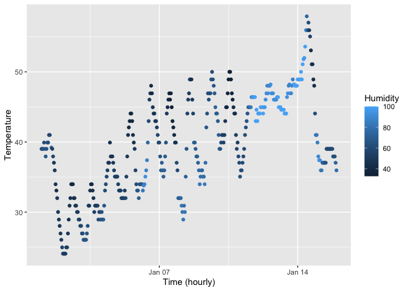

p8105_hw1_ls4236
================
Liliang Su
2025-09-11

## Problem 1

Load the `moderndive` library and `early_january_weather` dataset.

``` r
library(moderndive)

data("early_january_weather")
```

### Data Description

First of all, I try to write a brief description of the dataset using
inline R code.

``` r
head(early_january_weather)
```

    ## # A tibble: 6 × 15
    ##   origin  year month   day  hour  temp  dewp humid wind_dir wind_speed wind_gust
    ##   <chr>  <int> <int> <int> <int> <dbl> <dbl> <dbl>    <dbl>      <dbl>     <dbl>
    ## 1 EWR     2013     1     1     1  39.0  26.1  59.4      270      10.4         NA
    ## 2 EWR     2013     1     1     2  39.0  27.0  61.6      250       8.06        NA
    ## 3 EWR     2013     1     1     3  39.0  28.0  64.4      240      11.5         NA
    ## 4 EWR     2013     1     1     4  39.9  28.0  62.2      250      12.7         NA
    ## 5 EWR     2013     1     1     5  39.0  28.0  64.4      260      12.7         NA
    ## 6 EWR     2013     1     1     6  37.9  28.0  67.2      240      11.5         NA
    ## # ℹ 4 more variables: precip <dbl>, pressure <dbl>, visib <dbl>,
    ## #   time_hour <dttm>

As the above table shows, in `early_january_weather` dataset, there are
358 rows (samples) and 15 columns (variables), including origin, year,
month, day, hour, temp, dewp, humid, wind_dir, wind_speed, wind_gust,
precip, pressure, visib, time_hour. Specifically, key variables include:

- `origin`(`character`): the location of weather station.
- `year, month, day, hour`(`integer`): Time of recording.
- `temp` (`double`): air temperature in Fahrenheit.
- `humid` (`double`): relative humidity between 0 and 1.
- `wind_dir, wind_speed` (`double`): wind direction (in degrees) and
  speed(in mph).
- `time_hour` (`POSIXct`): Date and hour of the recording as a POSIXct
  date.

Notably, the `temp` column has an average temperature of 39.5821229.

### Plotting

Secondly, I try to create a scatterplot of `temp`(y) vs `time_hour`(x),
with color points using the `humid` variable.

``` r
plot_temp_th <- ggplot(early_january_weather, aes(x = time_hour,  y = temp, color = humid)) + geom_point() + labs(x = "Time (hourly)", y = "Temperature", color = "Humidity")

plot_temp_th
```

<!-- -->

``` r
ggsave("plot_temp_th.png", plot_temp_th, width = 8, height = 5)
```

Overall, the scatterplot shows that the temperature has increased over
time, rising from about 30°F in early January to around 50°F in
mid-January. Despite the upward trend, there has been frequent large
fluctuations in daily temperature. Humidity has shown a generally
positive correlation with temperature increase, with higher values more
common when temperatures are climbing, especially in mid-January.

## Problem 2

Here create a dataframe.

``` r
set.seed(123)
df <-
  tibble(
    vec_numeric = rnorm(10, mean=0, sd=1),
    vec_logical = vec_numeric > 0,
    vec_char = c(rep("apple",2), rep("grape",3), rep("kiwi",5)),
    vec_factor = factor(vec_char, levels = c("apple", "grape", "kiwi"))
  )

df
```

    ## # A tibble: 10 × 4
    ##    vec_numeric vec_logical vec_char vec_factor
    ##          <dbl> <lgl>       <chr>    <fct>     
    ##  1     -0.560  FALSE       apple    apple     
    ##  2     -0.230  FALSE       apple    apple     
    ##  3      1.56   TRUE        grape    grape     
    ##  4      0.0705 TRUE        grape    grape     
    ##  5      0.129  TRUE        grape    grape     
    ##  6      1.72   TRUE        kiwi     kiwi      
    ##  7      0.461  TRUE        kiwi     kiwi      
    ##  8     -1.27   FALSE       kiwi     kiwi      
    ##  9     -0.687  FALSE       kiwi     kiwi      
    ## 10     -0.446  FALSE       kiwi     kiwi

- The mean value of the column `vec_numeric` is 0.0746256.
- The mean value of the column `vec_logical` is 0.5.
- The mean value of the column `vec_char` is NA.
- The mean value of the column `vec_factor` is NA.

Next, try to applies the `as.numeric` function to the logical,
character, and factor variables.

``` r
as.numeric(df$vec_logical)
as.numeric(df$vec_char)
as.numeric(df$vec_factor)
```

- Applying `as.numeric` function to a logical vector converts `TRUE` to
  1 and `FALSE` to 0.
- For a character vector, the conversion does not work and produces `NA`
  values only.
- For a factor vector, for elements with predefined level, it returns
  the internal integer codes of the factor levels, and returns `NA` for
  elements that do not belong to either of the predefined level.

This helps explain why `mean` functions works on logical vector
(proportion of `TRUE`s), fails on character vector, and sometimes fails
to produce results on factor vector. Even if it successfully produce
results on factor vector, it still has little statistical
interpretations.
